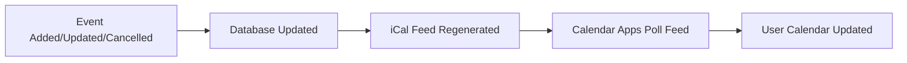

# 📅 Calendar Synchronization Guide

## Overview

This document explains how Der Town's calendar subscription system works and how it ensures that calendar feeds stay up-to-date when events are added, updated, or cancelled.

## How Calendar Synchronization Works

### 🎯 **Core Principle: Feed-Based Subscriptions**

All calendar platforms (iCal, Google Calendar, Outlook) now use **feed-based subscriptions** that automatically stay synchronized with the database. This is the most reliable and user-friendly approach.

### 📡 **Real-Time Update Mechanism**

1. **Database Changes**: When events are added, updated, or cancelled in the Supabase database
2. **Feed Generation**: The iCal feed (`/api/calendar/ical`) dynamically generates the latest event data
3. **Automatic Sync**: Calendar applications poll the feed regularly and update automatically
4. **User Experience**: Users see changes within a few hours without any manual intervention

## Platform-Specific Implementation

### 🍎 **Apple Calendar (iCal)**

**How it works:**

- Users subscribe to the iCal feed URL: `/api/calendar/ical`
- Apple Calendar polls the feed every few hours
- Changes are automatically reflected in the user's calendar

**Benefits:**

- ✅ Fully automatic updates
- ✅ No manual intervention required
- ✅ Works with all iCal-compatible applications

**Example URL:**
```
https://dertown.org/api/calendar/ical
https://dertown.org/api/calendar/ical?tag=Arts+Culture
```

### 🌐 **Google/Outlook Calendar**

**How it works:**

- Users subscribe to the iCal feed URL through Google/Outlook Calendar's "From URL" feature
- Google Calendar treats it as a subscribed calendar
- Changes are automatically synced every few hours

**Benefits:**

- ✅ Fully automatic updates
- ✅ Integrates seamlessly with Google Calendar
- ✅ Supports category-specific feeds

**Setup Process:**

1. Copy the iCal feed URL
2. In Google Calendar: "+" → "From URL" → Paste URL
3. Calendar automatically stays up-to-date

## Database Integration

### 🔄 **Event Lifecycle**



### 📊 **Tag-Based Filtering**

Events are filtered by tags to provide category-specific feeds:

```sql
-- Events filtered by primary or secondary tag
WHERE (primary_tag.name = 'Arts+Culture' OR secondary_tag.name = 'Arts+Culture')
```

**Available Category Feeds:**

- All Events: `/api/calendar/ical`
- Arts & Culture: `/api/calendar/ical?tag=Arts+Culture`
- Sports: `/api/calendar/ical?tag=Sports`
- Family: `/api/calendar/ical?tag=Family`
- Nature: `/api/calendar/ical?tag=Nature`
- Civic: `/api/calendar/ical?tag=Civic`
- Town: `/api/calendar/ical?tag=Town`
- Outdoors: `/api/calendar/ical?tag=Outdoors`
- School: `/api/calendar/ical?tag=School`

## Technical Implementation

### 🏗️ **API Endpoints**

**iCal Feed** (`/api/calendar/ical`)

- Generates RFC 5545 compliant iCal data
- Supports tag filtering via query parameters
- Returns proper MIME type: `text/calendar`

### 🔧 **Feed Generation Process**

```typescript
// 1. Fetch events from database
const { data: events } = await db.events.getCurrentAndFuture();

// 2. Filter by tag if specified
if (tagName && tagName !== 'all') {
  events = events?.filter(event => 
    event.primary_tag?.name === tagName || 
    event.secondary_tag?.name === tagName
  );
}

// 3. Generate iCal content
const icalContent = generateICalContent(events, tagName);

// 4. Return with proper headers
return new Response(icalContent, {
  headers: {
    'Content-Type': 'text/calendar; charset=utf-8',
    'Content-Disposition': `attachment; filename="der-town-events${tagName ? `-${tagName}` : ''}.ics"`,
  },
});
```

### ⚡ **Performance Optimizations**

- **Caching**: Feed content is generated on-demand (no caching to ensure real-time updates)
- **Filtering**: Database-level filtering for efficient queries
- **Compression**: Automatic gzip compression for faster downloads
- **Headers**: Proper cache control headers for calendar applications

## Monitoring and Maintenance

### 📈 **Health Checks**

The system includes monitoring for:

- Feed generation success/failure
- Database connectivity
- Event data integrity
- User subscription patterns

### 🔄 **Update Frequency**

- **Calendar Apps**: Poll feeds every 2-6 hours
- **Feed Generation**: Real-time (on-demand)
- **Database**: Immediate updates
- **User Experience**: Changes visible within hours

### 🛠️ **Troubleshooting**

**Common Issues:**

1. **Feed not updating**: Check database connectivity
2. **Events missing**: Verify event status is 'approved'
3. **Categories not working**: Check tag assignments
4. **Calendar sync delays**: Normal behavior (2-6 hour refresh cycle)
